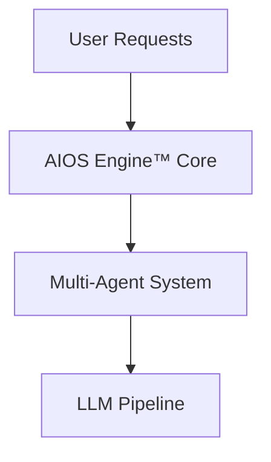

# Infigenie™ AIOS Engine™ Dashboard

Welcome to the AIOS Engine™ project dashboard.

## Roadmap & Milestones
- v1.1: Core AIOS Engine™ release
- v1.2: Multi-agent orchestration improvements
- v1.3: LLM integration

## Architecture Overview

## Tutorials & Case Studies

### Tutorial 1: Multi-Agent AIOS Engine™ setup
(Content pending)

### Tutorial 2: LLM integration & orchestration
(Content pending)

### Case Study: Performance benchmarks of AIOS Engine™
(Content pending)
